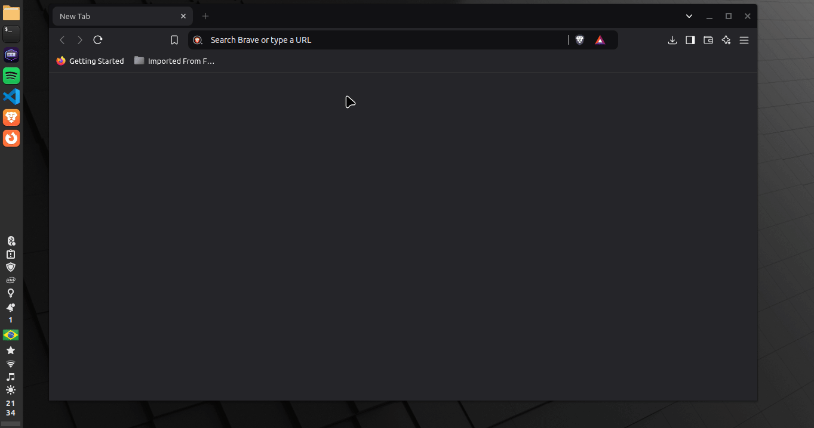

# Jogo da Velha Online PvE

Nome: Davi de Castro Machado

Curso: Ciência da Computação

Projeto: Jogo da Velha online PvE com criação de salas e armazenamento
de progresso de jogo pelo servidor, permitindo várias sessões de jogo simultâneas.

Objetivo: Desenvolver noções práticas de programação funcional.

Servidor Back-End desenvolvido em Haskell, aproveitando a robustez da programação funcional,
que garante segurança e confiabilidade ao projeto.

Front-End desenvolvido com HTML, CSS e JavaScript.

Processo de Desenvolvimento:

Os principais desafios incluíram: uso de múltiplas bibliotecas,
lógica de rotas e integridade das sessões de jogo.

A comunicação entre cliente e servidor foi desafiadora mas consegui chegar a um resultado
satisfatório, necessitei de fontes como StackOverflow e ChatGPT para compreender partes
do que estava fazendo mas ao final creio que o resultado foi engrandecedor, com um código
conciso e uma bagagem boa de aprendizado sobre programação funcional.

Resultado Final:

